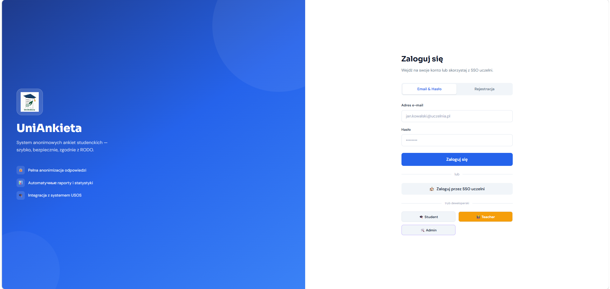
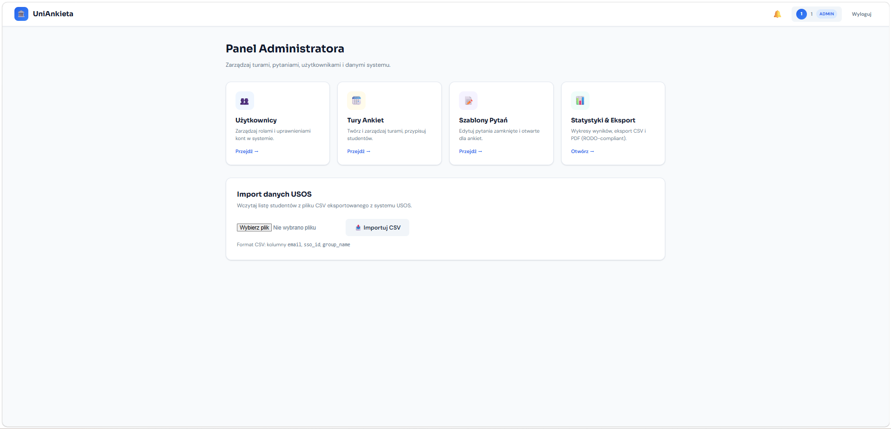
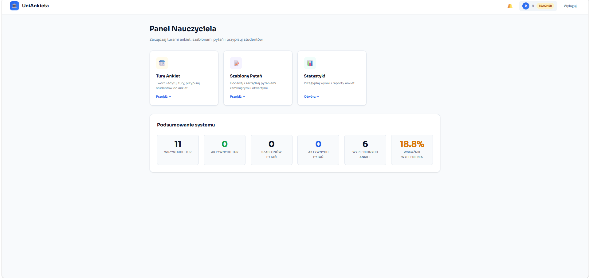
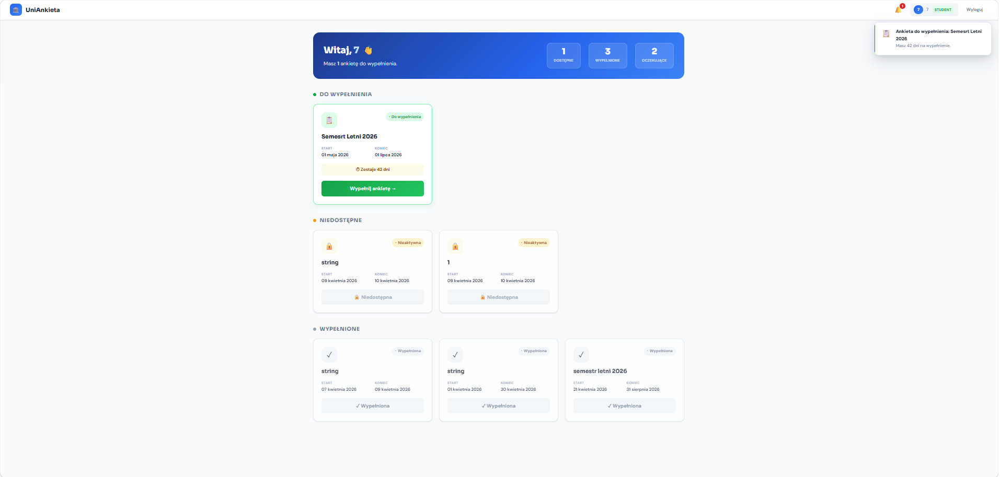

#UniAnkieta
> Akademicki system ankiet studenckich — szybki, anonimowy, zgodny z RODO.

[](https://fastapi.tiangolo.com/)
[](https://www.postgresql.org/)
[](https://vitejs.dev/)
[](https://docs.docker.com/compose/)


---

## Opis projektu

**UniAnkieta** to webowa platforma ankiet przeznaczona dla środowisk akademickich. Rozwiązuje problem ręcznego zbierania i analizy opinii studenckich — zastępuje papierowe formularze i rozproszone arkusze kalkulacyjne jednym, zintegrowanym systemem.

**Dla kogo:**
**Studenci** — wypełniają ankiety przypisane do ich grup, korzystając z jednorazowych, anonimowych tokenów
**Wykładowcy** — tworzą pytania, śledzą wskaźniki ukończenia tur w czasie rzeczywistym
**Administratorzy** — zarządzają użytkownikami, turami ankiet, importują dane z systemu USOS, eksportują raporty

**Kluczowe zalety:**
Pełna anonimizacja odpowiedzi dzięki systemowi jednorazowych tokenów UUID
Zgodność z RODO — odpowiedzi nie są powiązane z tożsamością studenta
Import studentów z pliku CSV (format USOS)
Eksport raportów w formacie PDF i CSV (`reportlab`)
Logowanie przez SSO (integracja z USOS)

---

## Sprint Plan

| Sprint | Cel (Kamień milowy)                              | Termin     |
|--------|--------------------------------------------------|------------|
| 1      | Konfiguracja środowiska, Docker, baza danych     | 17.03.2026 |
| 2      | Autentykacja JWT, SSO, system ról (UC-01)        | 24.03.2026 |
| 3      | Zarządzanie turami ankiet i pytaniami (UC-30)    | 02.04.2026 |
| 4      | Anonimowe wypełnianie ankiet, tokeny (UC-05)     | 30.04.2026 |
| 5      | Analityka, eksport PDF/CSV, dashboard admina     | 14.05.2026 |
| 6      | Panel nauczyciela, powiadomienia, import USOS    | 20.05.2026 |

---

## Autorzy

| Imię i nazwisko       | Rola                        |
|-----------------------|-----------------------------|
| Stanislav Kosheliev      | Backend (FastAPI, SQLAlchemy) |
| Amirseit Kystaubay      | Frontend (Vite, JavaScript)   |
| Aliaksei Kalcheuski    | DevOps / Baza danych (Docker, PostgreSQL) |

---

## Technologie

**Backend:**
Python 3.11, FastAPI 0.135, Uvicorn 0.42
SQLAlchemy 2.0 (ORM), Pydantic 2.12
PostgreSQL 15, psycopg2-binary
JWT (`python-jose`), bcrypt (`passlib`)
`reportlab` 4.2 — generowanie raportów PDF
`python-multipart` — obsługa plików CSV (import USOS)

**Frontend:**
Vite + Vanilla JavaScript (ES Modules)
Chart.js — wizualizacje i wykresy
Architektura SPA z routingiem po stronie klienta

**Infrastruktura:**
Docker 24+, Docker Compose v3.8
Trzy serwisy: `uniankieta_db`, `uniankieta_api`, `uniankieta_web`

---

## Kluczowe funkcjonalności

###  Administrator
Zarządzanie użytkownikami — przeglądanie, zmiana ról (Admin / Teacher / Student)
Tworzenie, edycja i usuwanie tur ankiet (`SurveyTour`)
Przypisywanie i usuwanie studentów z tur
Import studentów z pliku `.csv` (format USOS, kodowanie UTF-8-BOM)
Podgląd statusu tokenów (przypisany / wypełniony)
Eksport raportów analitycznych do PDF i CSV
Dashboard z globalnym wskaźnikiem wypełnienia ankiet

###  Nauczyciel
Tworzenie pytań otwartych (`open`) i zamkniętych (`closed`) z wariantami odpowiedzi
Aktywowanie i deaktywowanie pytań
Śledzenie wskaźnika ukończenia tur w czasie rzeczywistym (`TourCompletionTracker`)
Powiadomienia o turach kończących się w ciągu 48 godzin
Widok postępu per tura: przypisani / wypełnili

###  Student
Logowanie przez SSO (USOS) lub email + hasło
Przeglądanie przypisanych ankiet ze statusem (`Do wypełnienia`, `Wypełniona`, `Zakończona`)
Anonimowe wypełnianie ankiet za pomocą jednorazowego tokenu UUID
Powiadomienia o nowych i nadchodzących ankietach
Blokada ponownego wypełnienia (token `is_used = true`)

###  System i bezpieczeństwo
Autentykacja JWT (Bearer Token) na wszystkich chronionych endpointach
Logowanie SSO z callbackiem i automatycznym tworzeniem konta
Anonimizacja — odpowiedzi nie zawierają danych identyfikacyjnych studenta
Automatyczna migracja tabel przy starcie (`create_all` z retry loop)
Healthcheck bazy danych w Docker Compose

---

## Architektura projektu

Aplikacja zbudowana jest w architekturze **klient–serwer** z podziałem na trzy niezależne kontenery:

```
┌─────────────────────┐        REST API (JSON)       ┌──────────────────────┐
│   uniankieta_web    │ ◄──────────────────────────► │  uniankieta_api      │
│  Vite + JS SPA      │      http://localhost:8000    │  FastAPI + Uvicorn   │
│  port: 5173         │                               │  port: 8000          │
└─────────────────────┘                               └──────────┬───────────┘
                                                                 │ SQLAlchemy ORM
                                                                 ▼
                                                      ┌──────────────────────┐
                                                      │  uniankieta_db       │
                                                      │  PostgreSQL 15       │
                                                      │  port: 5432          │
                                                      └──────────────────────┘
```

**Przepływ autentykacji:**
1. Użytkownik loguje się przez SSO lub email/hasło (`POST /api/auth/login-password`)
2. Backend zwraca JWT Bearer Token
3. Frontend dołącza token do każdego zapytania: `Authorization: Bearer <token>`
4. Backend weryfikuje token i sprawdza rolę użytkownika przed wykonaniem akcji

**Anonimizacja odpowiedzi:**
1. Admin przypisuje studenta do tury → generowany jest UUID token (`SurveyToken`)
2. Student używa tokenu do wypełnienia ankiety
3. Po wypełnieniu token jest oznaczany jako `is_used = true`
4. Odpowiedzi (`Answer`) nie zawierają pola `user_id` — pełna anonimowość

---

## Instalacja

### Wymagania systemowe
Docker 24+ oraz Docker Compose v2+
**lub** Python 3.11+ i Node.js 18+ (uruchomienie lokalne)

### 1. Sklonuj repozytorium

```bash
git clone https://github.com/Terpow/UniAnkieta.git
cd uniankieta
```

### 2. Konfiguracja zmiennych środowiskowych

Utwórz plik `.env` w katalogu `backend/`:

```bash
cp backend/.env.example backend/.env
```

Zawartość `backend/.env`:

```env
DATABASE_URL=postgresql://user:password@db:5432/uniankieta
SECRET_KEY=zmień_na_losowy_klucz_min_32_znaki
ALGORITHM=HS256
FRONTEND_URL=http://localhost:5173
```

> **Uwaga:** Dla uruchomienia przez Docker Compose zmienne środowiskowe są już zdefiniowane w `docker-compose.yml` i plik `.env` nie jest wymagany.

---

## Uruchomienie aplikacji

### ▶ Opcja A: Docker Compose (zalecana)

Jedyne wymaganie: zainstalowany Docker Desktop lub Docker Engine z Compose.

```bash
# Zbuduj obrazy i uruchom wszystkie serwisy w tle
docker compose up --build -d

# Sprawdź logi
docker compose logs -f

# Zatrzymaj serwisy
docker compose down
```

Po uruchomieniu aplikacja dostępna pod adresami:

| Serwis       | URL                         | Kontener          |
|--------------|-----------------------------|-------------------|
| Frontend     | http://localhost:5173       | `uniankieta_web`  |
| Backend API  | http://localhost:8000       | `uniankieta_api`  |
| API Docs     | http://localhost:8000/docs  | `uniankieta_api`  |
| PostgreSQL   | localhost:5432              | `uniankieta_db`   |

---

### ▶ Opcja B: Uruchomienie lokalne (bez Dockera)

#### Backend

```bash
cd backend

# Utwórz i aktywuj środowisko wirtualne
python -m venv venv
source venv/bin/activate        # Linux/macOS
# venv\Scripts\activate         # Windows

# Zainstaluj zależności
pip install -r requirements.txt

# Skonfiguruj zmienne środowiskowe (edytuj .env)
cp .env.example .env

# Uruchom serwer deweloperski
uvicorn app.main:app --host 0.0.0.0 --port 8000 --reload
```

#### Frontend

```bash
cd frontend

# Zainstaluj zależności
npm install

# Skonfiguruj URL backendu
echo "VITE_API_URL=http://localhost:8000" > .env

# Uruchom serwer deweloperski
npm run dev
```

---

## Instrukcja użytkownika

### Jako Administrator

1. Otwórz przeglądarkę i przejdź pod adres `http://localhost:5173`
2. Zaloguj się kontem z rolą Admin  
   *(tryb demo: `admin@admin.pl` z dowolnym hasłem)*
3. W panelu admina możesz:
   **Zarządzanie turami** → utwórz turę, ustaw daty, aktywuj
   **Przypisz studentów** → dodaj studentów do tury (lub zaimportuj CSV z USOS)
   **Zarządzanie pytaniami** → dodaj pytania otwarte/zamknięte
   **Analityka** → przeglądaj wskaźniki, eksportuj raport PDF/CSV
   **Użytkownicy** → przeglądaj konta, zmieniaj role

### Jako Nauczyciel

1. Zaloguj się kontem z rolą Teacher  
   *(tryb demo: `teacher@teacher.pl` z dowolnym hasłem)*
2. W panelu nauczyciela możesz:
   Tworzyć i zarządzać pytaniami do ankiet
   Śledzić wskaźnik ukończenia tur (wykres progress bar per tura)
   Przeglądać powiadomienia o kończących się turach

###  Jako Student

1. Zaloguj się przez SSO lub kontem z rolą Student  
   *(tryb demo: `student@student.pl` z dowolnym hasłem)*
2. Na liście ankiet zobaczysz przypisane tury ze statusem:
   **Do wypełnienia** — aktywna, w terminie, token nieużyty
   **Wypełniona** — token oznaczony jako użyty
   **Zakończona** — tura po dacie końcowej
3. Kliknij turę i wypełnij ankietę — odpowiedzi są w pełni anonimowe

---

## Struktura repozytorium

```
uniankieta/
├── .github/
│   └── workflows/
│       └── ci.yml                # Konfiguracja CI/CD (GitHub Actions)
├── backend/
│   ├── app/
│   │   ├── api/
│   │   │   ├── admin.py          # Endpointy administracyjne
│   │   │   ├── analytics.py      # Analityka i eksport danych (Sprint 5)
│   │   │   ├── auth.py           # Autentykacja JWT i SSO
│   │   │   ├── questions.py      # Szablony pytań (UC-30)
│   │   │   ├── responses.py      # Wypełnianie ankiet (UC-05)
│   │   │   ├── teacher.py        # Panel nauczyciela (Sprint 6)
│   │   │   ├── tours.py          # Zarządzanie turami ankiet (UC-01)
│   │   │   └── usos.py           # Import plików CSV z USOS
│   │   ├── core/
│   │   │   ├── auth_service.py   # Logika SSO i automatyczne tworzenie użytkownika
│   │   │   ├── deps.py           # Zależności JWT (get_current_user)
│   │   │   └── security.py       # Generowanie tokenów (create_access_token)
│   │   ├── __init__.py
│   │   ├── database.py           # Konfiguracja SQLAlchemy i bazy danych
│   │   ├── main.py               # Punkt wejściowy FastAPI, rejestracja routerów
│   │   ├── models.py             # Modele ORM (User, SurveyTour, Answer, ...)
│   │   └── schemas.py            # Schematy Pydantic (walidacja danych)
│   ├── Dockerfile
│   └── requirements.txt
├── frontend/
│   ├── src/
│   │   ├── api.js                # Współdzielony helper fetch z obsługą JWT
│   │   ├── adminUsers.js         # Zarządzanie użytkownikami (UC-35)
│   │   ├── login.js              # Logowanie i obsługa tokenów
│   │   ├── TourCompletionTracker.js  # Wykres ukończenia tur ankiet (Sprint 6)
│   │   └── ...
│   ├── .gitignore                # Wykluczenia Gita dla frontend-u
│   ├── .gitkeep                  # Plik techniczny do zachowania struktury katalogów
│   ├── Dockerfile                # Konfiguracja Dockera dla frontend-u
│   ├── index.html                # Główny plik HTML aplikacji
│   ├── package-lock.json         # Plik blokady zależności npm
│   ├── package.json              # Skrypty i zależności projektu Node.js
│   ├── postcss.config.js         # Konfiguracja PostCSS (wymagana dla Tailwind)
│   ├── tailwind.config.js        # Konfiguracja stylów Tailwind CSS
│   └── vite.config.js            # Konfiguracja narzędzia budującego Vite
├── screenshots/                  # Zrzuty ekranu interfejsu aplikacji
│   ├── admin_dashboard.png
│   ├── admin_questions.png
│   ├── admin_tours.png
│   ├── admin_users.png
│   ├── completion_tracker.jpg
│   ├── login.png
│   ├── student_surveys.png
│   ├── survey_form.png
│   └── teacher_panel.png
├── docker-compose.yml
├── README.md
└── students.csv                  # Dane studentów i grup zaimportowane z USOS (Sprint 3)
```

---

## API

Pełna interaktywna dokumentacja Swagger UI dostępna pod: `http://localhost:8000/docs`

### Autentykacja

| Metoda | Endpoint                          | Opis                                      | Rola       |
|--------|-----------------------------------|-------------------------------------------|------------|
| `POST` | `/api/auth/login-password`        | Logowanie email + hasło, zwraca JWT       | Publiczny  |
| `POST` | `/api/auth/register`              | Rejestracja konta Student / Teacher       | Publiczny  |
| `GET`  | `/api/auth/sso-login`             | Przekierowanie do logowania SSO (USOS)    | Publiczny  |
| `GET`  | `/api/auth/sso-callback`          | Callback SSO, zwraca JWT w query param    | Publiczny  |
| `GET`  | `/api/auth/dev-login-admin`       | Szybkie logowanie Admin (tryb demo)       | Dev        |
| `GET`  | `/api/auth/dev-login-student`     | Szybkie logowanie Student (tryb demo)     | Dev        |
| `GET`  | `/api/auth/dev-login-teacher`     | Szybkie logowanie Teacher (tryb demo)     | Dev        |

### Tury ankiet

| Metoda   | Endpoint                                    | Opis                                      | Rola      |
|----------|---------------------------------------------|-------------------------------------------|-----------|
| `POST`   | `/api/admin/tours`                          | Utwórz nową turę                          | Admin     |
| `GET`    | `/api/admin/tours`                          | Lista wszystkich tur                      | Admin     |
| `PATCH`  | `/api/admin/tours/{tour_id}`                | Aktualizuj turę (daty, status)            | Admin     |
| `DELETE` | `/api/admin/tours/{tour_id}`                | Usuń turę i przypisane tokeny             | Admin     |
| `POST`   | `/api/admin/tours/{tour_id}/students/{id}`  | Przypisz studenta do tury (token UUID)    | Admin     |
| `DELETE` | `/api/admin/tours/{tour_id}/students/{id}`  | Usuń studenta z tury                      | Admin     |
| `GET`    | `/api/admin/tours/{tour_id}/students`       | Lista studentów z statusem tokenów        | Admin     |
| `GET`    | `/api/tours/my-surveys`                     | Ankiety przypisane do zalogowanego studenta | Student |
| `GET`    | `/api/tours/my-token/{tour_id}`             | Pobierz osobisty token do tury            | Student   |

### Pytania

| Metoda   | Endpoint                              | Opis                                   | Rola            |
|----------|---------------------------------------|----------------------------------------|-----------------|
| `POST`   | `/api/admin/questions`                | Utwórz pytanie (open / closed)         | Admin           |
| `GET`    | `/api/admin/questions`                | Lista wszystkich pytań                 | Admin           |
| `PATCH`  | `/api/admin/questions/{id}`           | Aktywuj / deaktywuj pytanie            | Admin           |
| `DELETE` | `/api/admin/questions/{id}`           | Usuń pytanie (cascade choices)         | Admin           |
| `POST`   | `/api/teacher/questions`              | Utwórz pytanie (panel nauczyciela)     | Teacher / Admin |
| `GET`    | `/api/teacher/questions`              | Lista pytań (panel nauczyciela)        | Teacher / Admin |
| `PATCH`  | `/api/teacher/questions/{id}`         | Toggle aktywności pytania              | Teacher / Admin |
| `DELETE` | `/api/teacher/questions/{id}`         | Usuń pytanie                           | Teacher / Admin |

### Analityka i eksport

| Metoda | Endpoint                               | Opis                                         | Rola  |
|--------|----------------------------------------|----------------------------------------------|-------|
| `GET`  | `/api/admin/analytics/summary`         | Globalne statystyki (ankiety, wskaźnik %)    | Admin |
| `GET`  | `/api/admin/analytics/export/pdf`      | Eksport raportu do PDF (`reportlab`)          | Admin |
| `GET`  | `/api/admin/analytics/export/csv`      | Eksport danych do CSV                         | Admin |

### Import i powiadomienia

| Metoda | Endpoint                          | Opis                                        | Rola    |
|--------|-----------------------------------|---------------------------------------------|---------|
| `POST` | `/api/usos/import-students`       | Import studentów z pliku CSV (USOS)         | Admin   |
| `GET`  | `/api/notifications`              | Spersonalizowane powiadomienia in-app        | Każdy   |
| `GET`  | `/healthcheck`                    | Status serwera API                           | Publiczny |

---

## Zrzuty ekranu

| Ekran                  | Plik                                    |
|------------------------|-----------------------------------------|
| Ekran logowania        | `screenshots/login.png`                 |
| Dashboard admina       | `screenshots/admin_dashboard.png`       |
| Zarządzanie turami     | `screenshots/admin_tours.png`           |
| Zarządzanie pytaniami  | `screenshots/admin_questions.png`       |
| Lista użytkowników     | `screenshots/admin_users.png`           |
| Panel nauczyciela      | `screenshots/teacher_panel.png`         |
| Tracker ukończenia tur | `screenshots/completion_tracker.png`    |
| Widok studenta         | `screenshots/student_surveys.png`       |
| Formularz ankiety      | `screenshots/survey_form.png`           |

```




```

---

## Status projektu


| Moduł                          | Status        |
|--------------------------------|---------------|
| Autentykacja JWT + SSO         |  Gotowe     |
| Zarządzanie turami             |  Gotowe     |
| System pytań i odpowiedzi      |  Gotowe     |
| Anonimowe tokeny (UC-05)       |  Gotowe     |
| Analityka + eksport PDF/CSV    |  Gotowe     |
| Panel nauczyciela              |  Gotowe     |
| Import USOS (CSV)              |  Gotowe     |
| Powiadomienia in-app           |  Gotowe     |
| Testy jednostkowe              |  W trakcie  |

Projekt realizowany w ramach kursu **Projekt Zespołowy Systemów Informatycznych 2026**.

---

## Licencja

Projekt edukacyjny — przeznaczony wyłącznie do celów akademickich.

© 2026 Zespół UniAnkieta
